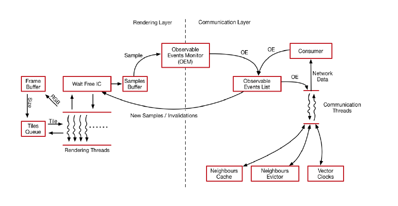
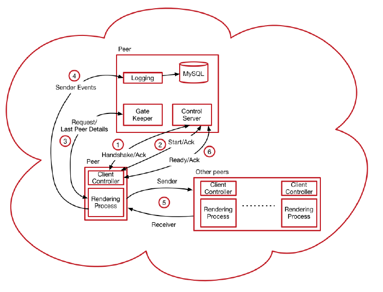
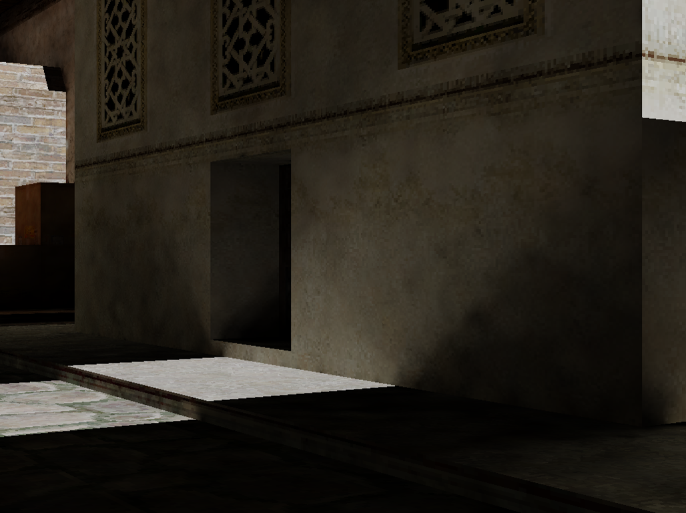

# Code Samples

The code samples are composed from:

## Sample 1

Code sample 1 contains 4 different solutions to solve the nbody problem:

1. Cuda straight forward implementation
  -  Spawning of a cuda thread for every body in the system
2. Cuda implementation that decreases computations from `O(N^2)` to `O(N^2/2)`
  -  Through sharing of computations and a further step for gathering of results
3. C++ threads implementation making use of a producer and multiple consumers.
  - The producer contains a list of tasks
  - The consumers will continue to consume tasks until signalled
  - Producer and Consumers operate in a lock-step fashion
4. OpenMP implementation
  - Makes use of the SSE3 instruction set for improved performance

## Sample 2
Code sample 2 contains the work of my Master's thesis, which involves the fields of high-fidelity rendering, distributed systems and high performance computing. The dissertation builds upon the research of [Bugeja et al.](https://diglib.eg.org/handle/10.2312/pgv.20141079.009-016)

### Background

The original authors proposed a novel technique for collaborative HFR, applicable for scenarios where peers are collaborating together in the same environment; such as, peers interacting in an online multiplayer environment.

Through the application of a peer-to-peer topology, peers calculate irradiance samples, which in turn are grouped, given a unique identifier and shared with other peers. If a peer receives the indirect light information for a particular area in the scene, it would allow the respective peer to gain a speedup through amortisation, since the peer would not have to calculate the indirect lighting samples but just aquire them and use them. which is much faster and thus achieving aspeed-up.

At any point in time peers would pick a random peer from their local cache of peer details (The cache only contains a subset of all the peers collaborating over the network), once two peers communicate they will reconcile their indirect lighting caches.

The state of the art in collaborative HFR happened to have questions related to scalability of the collaboration. Moreover, peers do not discriminate to whom data is passed (Since the Anti-Entropy is a random walk based technique) and at each turn a peer would always pick a random peer from the sub-set of local peer details.

### System Architecture



The System is composed from two major components(as shown in the figure above); the rendering component, which delivers physically correct illumination through the Irradiance Cache and the communication layer, which takes care of sending and receiving new data to other peers collaorating on the peer-to-peer network.

The irradiance cache is a physically correct rendering technique able to improve the time taken to compute indirect diffuse inter-reflections, through the re-use of previously computed irradiance samples. Samples are computed on demand, if a sample is computed it means that no other samples could be used to interpolate an approximate result for that position in the scene.

1. A frame is split into a number of equal tiles, such that different threads can handle different parts of the screen to be rendered
2. All threads can access the shared irradiance cache safely as the irradiance cache makes use of wait-free mechanisims to ensure safety (use of `compare and swap`  and `fetch and add` atomic operations).
3. Each new indirect lighting information created by any of the rendering threads are pushed onto a queue, which is monitored by the 'OEM'.
4. The OEM takes care of grabbing the samples, grouping them in groups of 100 and creates new 'observable events' that are passed onto the 'observable events list'

On the other hand, the system makes use of a peer-to-peer architecture for the sharing of computed irradiance samples and data is disseminated through the network through the use of the Anti-Entropy technique, a technique which mimics how viruses spread in biological populations.

1. Each peer contains two communication threads, one that takes care of initiating new communications with new random peers and the other takes care of receiving communications from other peers.
2. Upon reconciliation, the threads would share locally stored new observable events.
3. Received samples are not added to the list of observable events by the respective communication thread, but passed onto another thread which takes care of committing the new updates the irradiance cache. This method was used as a precaution as not to allow the communication threads to lose time on adding updates but be solely responsible for communication.
4. More details about the communication protocol can be found in chapter 4 of the dissertation.

### Overall Test Setup


The system was wholly deployed on the Azure cloud, where a system of 16 VMs was employed for the peer-to-peer network, while another VM was dedicated to the management and logging purposes of the system. In fact another of utility tools had to be built, as to provide efficient management for test runs, executions and even examining of results.

1. `Gate Keeper`: The gate keeper is the bootstrapping mechanism to access the collaboration over the network. Once you connect to the gate keeper, he would send you back the details of the latest connector, whom of which would share its cache of know peers and thus you would have been successfully introduced to the network.

2. `Peer Management System`: The peer management system is a Client/Server tool, built to manage when the peers would start collaborating with other the peers; built using C# and WPF. A domain specific language was constructed, as to allow the scripting of peer behavior.

3. `Logging Server`: The logging server was introduced in the late stages of the research, for further examination of the behavior of the last contribution of this dissertation. The sole intention was for it to register all communications ongoing between the peers, and use the logged data to extract patterns of communication with other peers on the basis of context awareness; the logging server was built using a REST NodeJS server, with a MySQL database for persistence.   


### Contribution 1
Replication of the experiments carried out by the original authors, while using the same data sets used by Bugeja et al. Moreover, the experiments were scaled to 16 peers, as to examine the relationship between scalability and over-saturation, as detailed in Chapter 4 of the dissertation.

### Contribution 2
Proposal of an improvement method for the rendering algorithm that is called the two-phase irradiance cache (`2PIC`).A technique that is able to address the over-saturation issue measured in Chapter 4.
The technique's performance was measured according to two facets, namely quality and network performance.
For quality, the amount of error introduced by the two level caching technique, had to be quantified.
Thus, 7 different scenes were chosen that had different amount of geometric complexity and level of detail.
Renders created by 2PIC were compared to the same shots rendered with the irradiance cache and the amount of error was measured through the use of the PSNR.

On the other hand, network performance was examined by running the same experiments that were run in Chapter 4 and compared with them. 2PIC was able to overcome over-saturation, while gaining a two-fold improvement across both 8 and 16 peers, only through sharing of computations cared out by the individual peers.

### Contribution 3
Proposal of a novel technique for an improved data dissemination between peers, which is called the context aware peer-to-peer (`CAP2P`). The proposed technique makes use of different scene and hardware variables, which are referred to as Contexts.

Contexts provide the means for peers to prioritise message passing towards other peers, such that, peers exchange more useful data. Through the application of a distributed publisher-subscriber design pattern, context were applied to the peer-to-peer system.
The Data received from the context server about other peers, allows a said peer to weight peers according to a specific context, and build a respective probability distribution function (PDF), whichallows peers to communicate with each other at different frequencies. Since, peers with a higher probability will be communicated more frequently.

Overall, the technique was still capable of maintaining the two-fold improvement achieved through 2PIC, signifying that no inefficiencies were introduced by the new method.

Results suggest that through the application of specific contexts, some peers, were able to exploit the data returned by the contexts, allowing individual peers to receive more useful data and improve their performance by two-fold over that achieved by 2PIC; however, this technique still requires further analysis on the frequency of data exchanges between the different peers.



### Improving Sample 2
The code created for this dissertation was firstly built for research basis, moreover, the initial intent was that mid-research the code created was to be rewritten from scratch as to improve performance and maintainability, however due to deadlines of the Master's I could not afford to rewrite artefact from scratch.

Performance wise, specific sections that are used repeatedly had to be written with less levels of abstraction; such as, compute intensive code, as to allow these instructions to be stored in the cache.  

### Executable
A copy of the Executables along with the assets required for the work have been provided under the __CodeSamples 2/Executables/ExamplePeer/__ directory.

1. NetworkExecution.bat runs the system in networked mode, along with the use of contexts

2. NoNetwork.bat runs the system as a rendering system only

A copy of my dissertation can be acquired from [here](./GithubPagesAssets/main.pdf)

## Compiling the Sources
To compile all the sources an environmental variable `BOOST_DIR` must be setup, specifying a directory containing a Boost Library 1.64.

## Feedback
Any feedback on how to improve the code further would be greatly appreciated.

<!-- ## Welcome to GitHub Pages

You can use the [editor on GitHub](https://github.com/adriandebarro/codeplay_samples/edit/master/README.md) to maintain and preview the content for your website in Markdown files.

Whenever you commit to this repository, GitHub Pages will run [Jekyll](https://jekyllrb.com/) to rebuild the pages in your site, from the content in your Markdown files.

### Markdown

Markdown is a lightweight and easy-to-use syntax for styling your writing. It includes conventions for

```markdown
Syntax highlighted code block

# Header 1
## Header 2
### Header 3

- Bulleted
- List

1. Numbered
2. List

**Bold** and _Italic_ and `Code` text

[Link](url) and 
```

For more details see [GitHub Flavored Markdown](https://guides.github.com/features/mastering-markdown/).

### Jekyll Themes

Your Pages site will use the layout and styles from the Jekyll theme you have selected in your [repository settings](https://github.com/adriandebarro/codeplay_samples/settings). The name of this theme is saved in the Jekyll `_config.yml` configuration file.

### Support or Contact

Having trouble with Pages? Check out our [documentation](https://help.github.com/categories/github-pages-basics/) or [contact support](https://github.com/contact) and we’ll help you sort it out. -->
